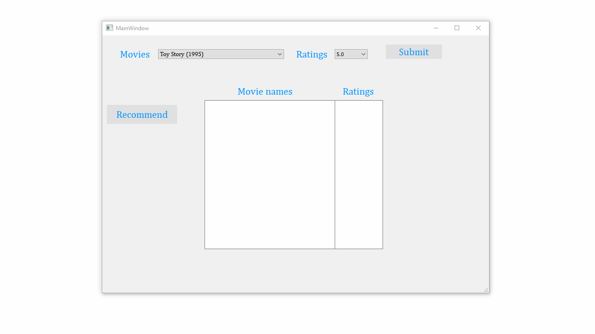

# Overview
provides movie recommendation based on user ratings written in spark and qt for user interface

# Requirements
note: doesnt work on spark 2.4

1.  Download spark 2.3 from the below link extract to C:/spark-2.3.3-bin-hadoop2.7 
    SPARK_HOME=C:/spark-2.3.3-bin-hadoop2.7 and
    PATH=C:\spark-2.3.3-bin-hadoop2.7/bin

    https://www.apache.org/dyn/closer.lua/spark/spark-2.3.3/spark-2.3.3-bin-hadoop2.7.tgz

2.  Install java 8 to c:/java
    JAVA_HOME=C:\java
    
    
3.  copy winutils to c:\bin   
    set HADOOP_HOME=c:\
    https://github.com/steveloughran/winutils/blob/master/hadoop-2.7.1/bin/winutils.exe

4.  pip install pyside2
    pip install pyspark

# work in progress

